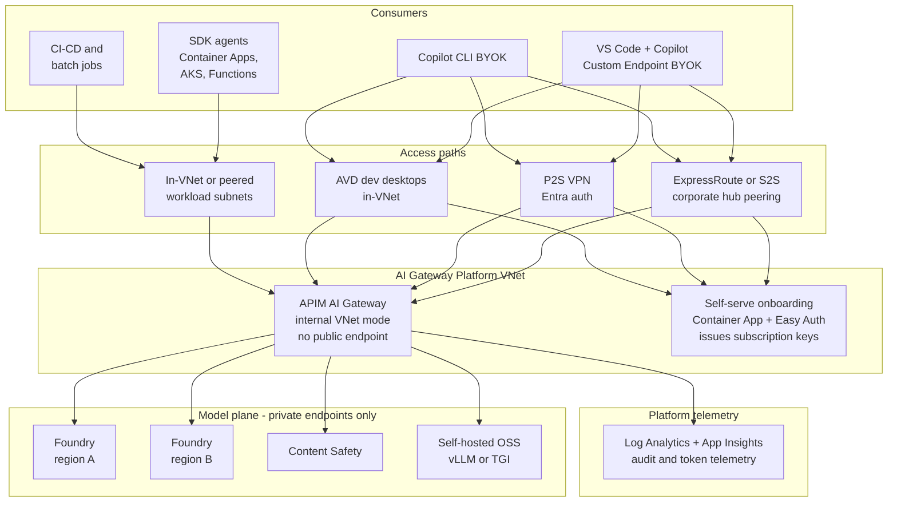
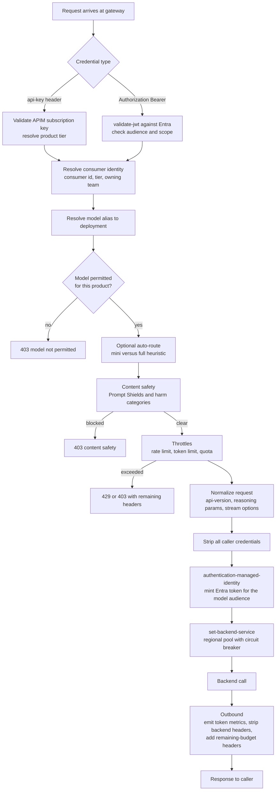
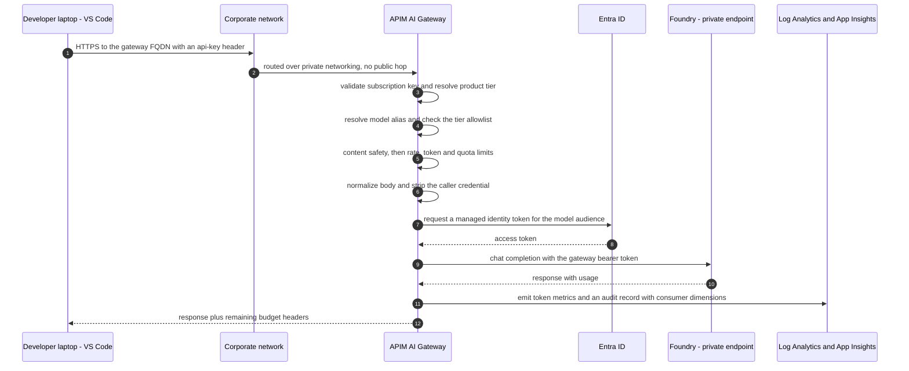
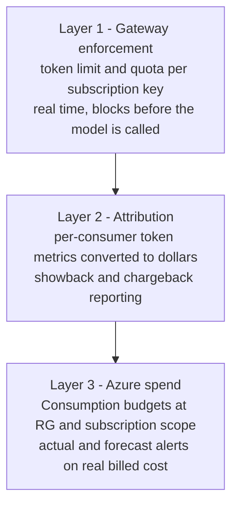

# Architecture — AI Gateway Platform

**BLUF.** Every model call in the enterprise goes through one governed front door: Azure API
Management running as an AI gateway, deployed in internal VNet mode, fronting Azure AI Foundry
accounts that are reachable only over private endpoints. The gateway is where identity, model
allowlisting, content safety, throttling, cost attribution and audit are enforced — not in the
client, not in the model account. Clients hold a credential scoped to a product tier and nothing
else; they never hold a Foundry key and never see a model endpoint.

---

## 1. Scope

**In scope**

- A single governed inference plane for OpenAI-shape models, Anthropic-shape models, and
  open-source models (Foundry-hosted or self-hosted).
- Two consumer classes: **SDK agents** (services) and **developer IDE surfaces** (VS Code +
  GitHub Copilot BYOK, Copilot CLI).
- Enforcement of throttling, quotas, model allowlists, content safety, cost attribution, audit.
- Deployable to **Azure Government and Commercial**, region-selectable, from one template.

**Explicitly out of scope for v1**

- Agent hosting. The platform governs model access; teams keep owning their own agent runtimes.
- Data plane for RAG (vector stores, indexes). Consumers bring their own.
- Replacing GitHub Copilot's SaaS service. BYOK re-points inference only.
- Fine-tuning and model training pipelines.

---

## 2. Design decisions

| # | Decision | Choice | Why |
|---|---|---|---|
| D1 | Gateway product | APIM, classic tier, **internal VNet injection** | Only classic Developer/Premium support VNet injection in Gov. Internal mode gives the gateway no public endpoint at all. |
| D2 | Model account exposure | Foundry with `publicNetworkAccess=Disabled`, `disableLocalAuth=true`, private endpoint only | Removes key-based access entirely. The gateway managed identity is the only caller. |
| D3 | Client credential | **Dual mode.** APIM subscription key (`api-key` header) for IDE/BYOK; Entra JWT or managed identity for SDK agents | IDE clients cannot refresh a 1-hour token. Services can and should. Forcing one mode breaks one class of consumer. |
| D4 | Consumer unit | One subscription key per **developer** (BYOK) or per **workload** (agent) | Attribution and revocation need a 1:1 mapping to a real owner. Shared keys destroy both. |
| D5 | Model naming | Clients call **logical aliases** (`chat-frontier`, `chat-mini`, `reasoning`, `embeddings`) resolved to real deployments — using APIM's **unified model API** where available | Decouples 1000+ clients from model version churn. Model upgrades become a gateway change, not a fleet change. Microsoft productized exactly this pattern; prefer it over hand-rolled policy. |
| D6 | Multi-region | Backend **pool with circuit breaker** from day one — for **availability**, not for quota | Capacity 429s are the normal failure mode at this scale. But standard quota is *subscription*-scoped, so pooling instances in one subscription adds no throughput. Quota comes from deployment type. |
| D7 | Cloud parity | One template, `cloudEnv` parameter drives a `cloudVars` lookup map | Gov and Commercial differ only in endpoints, DNS zones, audiences and available SKUs. Hard-coding either creates a fork. |
| D8 | Feature gating | Every capability behind a `deploy*` boolean, default off except the core path | Lets the pilot be small and the production stack be complete from the same code. |
| D9 | Onboarding | Self-serve portal, group-driven tiering | 1000+ developers cannot be hand-provisioned. This is not optional at this scale. |
| D10 | Enforcement location | Gateway first, app second | A control that lives in the client is a suggestion. Anything mandatory is a gateway policy. |
| D11 | Stateful routing | **Session-aware** pool distribution for the Responses API | Responses is stateful. Round-robin across a pool breaks conversations mid-flight. |
| D12 | Gateway placement | Gateway in its own resource group, colocated in-region with the model accounts it fronts | Microsoft's guidance: separation of concerns for APIOps, and cross-region backend calls add latency and egress cost. |

> **Reviewed against Microsoft's published guidance.** See
> [microsoft-guidance-alignment.md](microsoft-guidance-alignment.md) for the point-by-point
> comparison against the Azure Architecture Center gateway guides, the API Management AI gateway
> documentation, Foundry network isolation, and the Well-Architected Framework AI guidance —
> including where we deliberately differ.

---

## 3. Logical architecture

Nothing in the model plane is reachable from a consumer. The only path to a model is through the
gateway, and the only credential that opens a model account is the gateway's managed identity.

---

## 4. Consumers and access paths

| Consumer | Credential | Path it calls | Reaches gateway via |
|---|---|---|---|
| VS Code + Copilot (Custom Endpoint) | APIM subscription key in `api-key` header | `/openai/v1/chat/completions`, `/openai/v1/responses` | Corporate network, VPN, or AVD |
| Copilot CLI (BYOK) | APIM subscription key, or Entra JWT | `/openai/v1/chat/completions` | Corporate network, VPN, or AVD |
| SDK agent (Python/TS/.NET) | Managed identity token, or Entra JWT | Any inference route | In-VNet directly, or via peering |
| CI/CD, batch, eval jobs | APIM subscription key scoped to a workload | Any inference route | In-VNet or self-hosted runner |

Three developer access paths are supported and parameterized. They are not mutually exclusive.

1. **ExpressRoute / S2S to a corporate hub, peered to the platform VNet.** The end state for a
   1000-developer fleet. No per-device configuration.
2. **P2S VPN (Entra auth).** Good for the pilot and for remote/contractor access. Be aware:
   managed Windows laptops have repeatedly failed the TLS handshake to private endpoints over P2S
   in prior work — validate on a real corporate image before committing to this as the primary path.
3. **AVD / dev VDI inside the VNet.** Removes the laptop networking problem entirely, at the cost
   of a desktop estate. Worth costing if path 1 is blocked.

**Recommendation:** design for path 1, run the pilot on path 2, keep path 3 as the fallback if
corporate networking is slow to land.

---

## 5. The gateway

### 5.1 SKU and topology

| Setting | Pilot | Production |
|---|---|---|
| SKU | Classic **Developer**, 1 unit | Classic **Premium**, multi-unit |
| VNet | `Internal` injection | `Internal` injection, multi-region deployment |
| SLA | none | 99.99% with availability zones |
| Approx cost | tens of dollars/month | thousands of dollars/month per unit |

The v2 tiers (Basic/Standard/Premium v2) are **not available in Azure Government** — verify at
deploy time, but plan on classic. Classic Developer and Premium are the only tiers supporting VNet
injection. That makes the Developer→Premium step a real cost cliff and it is the single biggest
line item in the platform. `apimSku` is a parameter so the pilot does not pay for it.

Capacity for 1000+ developers is an **open item**: LLM traffic is long-lived streaming
connections, which is not what standard APIM capacity guidance is modeled on. Load test before
sizing units. See [Open items](#12-open-items).

### 5.2 API surface

| API | Path | Shape | Backends |
|---|---|---|---|
| `ai-inference` | `/openai/v1/*` | OpenAI-compatible — `chat/completions`, `responses`, `embeddings`, `completions`, `models` | Foundry deployments, Foundry MaaS OSS, self-hosted OSS |
| `ai-unified` | `/llm/v1/*` | OpenAI-compatible **with backend format translation** | Anything above, plus Anthropic-shape models |

One OpenAI-compatible surface covers almost everything, because Foundry MaaS and vLLM/TGI both
speak it.

**Anthropic is the exception, and the answer changed after reviewing current guidance.** The
native Anthropic Messages schema is supported only in the API Management **v2 tiers** — which we
cannot use, because Gov requires classic and only classic supports VNet injection. So a native
`/anthropic/v1/messages` route is off the table. Instead, Anthropic models are exposed through
APIM's **unified model API**, which accepts OpenAI Chat Completions on the client side and
translates to the Anthropic Messages format at the backend. Clients get one shape; we get Claude.

The unified model API is in **preview** and reaches classic tiers through the **AI Gateway early
release channel**. That is an opt-in service-update setting, and it is the deciding factor for
whether we adopt it in v1 or hand-roll the alias layer in policy. Flagged as an open item.

`GET /openai/v1/models` (and the unified API's `/models`) returns the **allowlisted catalog for
the calling product**, not the raw list of deployments. OpenAI-compatible IDE clients require a
model list to connect, and this is also where the model allowlist becomes visible to the developer.

### 5.3 Products and tiers

A product defines the limits. A subscription key belongs to exactly one product. Every product
stacks three throttles keyed on the subscription ID:

- `rate-limit-by-key` — burst control, calls per minute
- `azure-openai-token-limit` / `llm-token-limit` — the real cost guard, tokens per minute
- `quota-by-key` — hard monthly ceiling

Starting proposal, to be validated against deployment capacity:

| Product | Consumer | Calls/min | Tokens/min | Monthly calls | Catalog |
|---|---|---|---|---|---|
| `sandbox` | experimentation | 20 | 50,000 | 10,000 | `chat-mini` only |
| `dev-standard` | one developer | 60 | 200,000 | 50,000 | mini, frontier, embeddings |
| `dev-power` | one developer, heavy agentic | 120 | 400,000 | 200,000 | + reasoning, Anthropic |
| `agent-standard` | one non-prod workload | 300 | 500,000 | 500,000 | mini, frontier, embeddings |
| `agent-production` | one production workload | 600 | 1,000,000 | contracted | full catalog, priority pool |

**Sizing note that has bitten before:** VS Code Copilot Chat with full workspace context sends
30–80k tokens in a *single* request. A 60k TPM tier is tripped by one chat turn. Developer tiers
below ~200k TPM are not usable — this is not theoretical, it was measured.

### 5.4 Policy chain

Two steps are load-bearing and easy to get wrong:

- **Strip all caller credentials before the backend call.** The caller's key or JWT must never
  reach Foundry. The gateway reauthenticates with its own managed identity.
- **Normalize the request.** Reasoning models (gpt-5 family, o-series) reject non-default
  `temperature`, `top_p`, `presence_penalty`, `frequency_penalty` — the policy strips them by
  model-name prefix. Streaming responses only report usage when `stream_options.include_usage` is
  injected, and that field only exists on api-version 2024-09-01-preview and later. Both fixes
  belong in the gateway, once, not in 1000 clients.

### 5.5 Request flow

A developer request from VS Code, end to end. The SDK agent path is identical except the caller
presents an Entra token instead of a subscription key, and reaches the gateway in-VNet directly.

Note what the developer never has: a Foundry endpoint, a Foundry key, or any Azure role on the
model plane. Revoking one subscription key removes their access completely.

### 5.6 Backends and resilience

- One URL backend per Foundry region and instance, plus a **pool** backend that clients are
  actually routed to.
- **Circuit breaker** per pool member: trip after N failures in a window, honor `Retry-After` so
  capacity 429s spill to the next member promptly rather than retrying into a wall.
- Pool strategy is a parameter: `priority` (active/passive), `weighted` (active/active),
  round-robin, or **session-aware** for the stateful Responses surface.
- Self-hosted OSS backends register the same way and route by model-alias prefix.

Four constraints from Microsoft's gateway guidance that shape this:

1. **Every pool member must serve the same model at the same version.** Never fail over or load
   balance from version *X* to *X+1* — clients see unexplained behaviour changes. Version
   consistency across regions is a hard requirement of the alias design, not a nicety.
2. **Don't try to predict throttling.** Tracking prior consumption to pre-empt a 429 is possible
   but full of edge cases. Drive routing from actual HTTP response codes and `Retry-After`. This
   is also the argument against `estimate-prompt-tokens="true"` on the token-limit policy, which
   rejects requests before forwarding and produces confusing 429s on a single large chat turn.
3. **A single-region gateway fronting multi-region backends is a global single point of failure.**
   It protects against a *model* outage, not a *gateway* outage. That is an acceptable trade for
   a developer-productivity platform and an unacceptable one for business-critical workloads. If
   the SLO tightens, the answer is multi-region APIM with per-region backend routing logic in
   policy — and even then the APIM control plane stays single-region.
4. **Health checks need more than the default.** APIM's built-in `/status-0123456789abcdef` only
   reports the gateway, not the model backends behind it. Expose a dedicated health API that
   reflects backend and route availability, for clients and for the operations team.

---

## 6. Model plane

### 6.1 Catalog

Clients call a **logical alias**. The gateway maps the alias to a real deployment. This is the
single highest-value governance decision in the design — it makes model upgrades, deprecations
and regional failover invisible to consumers, and it is the mechanism that makes planned model
end-of-life a non-event.

| Alias | Backs onto | Purpose |
|---|---|---|
| `chat-frontier` | current frontier chat deployment | Default interactive and agentic chat |
| `chat-mini` | small/cheap deployment | Routing, classification, high-volume cheap calls |
| `reasoning` | o-series deployment | Deliberate reasoning tasks |
| `embeddings` | embeddings deployment | RAG, semantic cache |
| `claude` | Anthropic model via Foundry, format-translated | Claude access on an OpenAI-shape client |
| `oss-<name>` | Foundry MaaS or self-hosted vLLM/TGI | Open-source serving |
| `auto` | gateway-selected | In-gateway heuristic router (mini vs frontier) |

An alias must resolve to the **same model and version in every region it is served from**. Where
that is impossible — model availability in Government lags Commercial and varies by region — the
alias is region-scoped and the catalog is parameterized per deployment. Do not assume parity.

**Use provider-native routing before building your own.** The `auto` alias is a cheap heuristic
and it adds non-determinism. Microsoft's guidance is to prefer a provider-native router when one
is available, and to avoid routers entirely where deterministic behaviour matters. `auto` is
off by default and opt-in per product.

### 6.2 Account posture

- `publicNetworkAccess: Disabled`, `disableLocalAuth: true`, private endpoint only. Foundry also
  supports a middle state — *enabled from selected IP addresses* — which we do not use.
- Private DNS zones for `openai`, `cognitiveservices`, and `services.ai` privatelink names,
  linked to the platform VNet and to any peered hub.
- **Clients must call the account's custom subdomain**, never the `*.privatelink.*` hostname.
  The privatelink name is an internal CNAME hop in Azure's resolution chain; calling it directly
  fails.
- **NSG on the private-endpoint subnet permits only the gateway subnet.** The private endpoint
  existing is not the control — restricting who can reach it is. This is explicit in Microsoft's
  gateway guidance and it is what makes "the gateway is the only path" true rather than aspirational.
- Responsible AI policy attached to every deployment. **Not `Microsoft.DefaultV2`** — its
  Jailbreak shield is set to blocking and it reliably rejects VS Code Copilot's own system prompts
  with `400 content_filter`. Use a policy with Jailbreak set to annotate-only (`blocking: false,
  enabled: true`), which does not require a modified-content-filter approval.
- Deployment `sku.capacity` is in units of 1,000 TPM. **Product TPM must never exceed deployment
  capacity**, or the gateway cheerfully admits traffic the model account then rejects with 429.
- **Trusted-services bypass** (`networkAcls.bypass = AzureServices`) is needed if other Azure
  services must reach the account with a managed identity while public access is off. Grant it
  deliberately; it is a hole in an otherwise closed account.

**If we ever host Foundry Agent Service in-platform** (not in v1 scope, but it changes the network
design), two things become load-bearing:

- Outbound isolation is **VNet injection of the agent client** into a subnet delegated to
  `Microsoft.App/environments`, **/27 or larger**.
- **Outbound networking cannot be changed after deployment.** The delegated subnet is fixed, and
  an existing Foundry resource cannot have VNet injection added later — it must be redeployed.
  Decide at first provision or accept a rebuild.

### 6.3 Capacity at 1000+ developers

Aggregate demand at this scale exceeds any single deployment. **Deployment type is the first
lever, not the gateway.** Microsoft is explicit: do not build a gateway to increase quota — use
deployment types that draw on Azure's global capacity.

| Deployment type | What it gives | Residency implication |
|---|---|---|
| **Global Standard** | Requests routed to any region with capacity. Largest quota, fewest 429s. | Data at rest stays in the geography. **Inference may be processed in any hosting location.** |
| **Data Zone Standard** | Requests routed within a defined geographic zone. | Processing constrained to the zone. The usual compromise. |
| **Standard (regional)** | Pinned to one region. | Strictest residency, smallest quota, most throttling. |
| **Provisioned (PTU)** | Reserved capacity, predictable latency. | Regional. Bought, not requested. |

**This is a compliance decision before it is a capacity decision**, and it is the single question
most likely to change the design. If the data classification permits Global Standard, most of the
capacity problem disappears. If it requires regional-only processing, we are in overcommit
territory and PTU becomes likely for production agents.

On top of the deployment type:

- **Standard quota is subscription-scoped, not instance-scoped.** Deploying more Foundry instances
  in the *same* subscription adds no throughput. Real quota expansion needs multiple subscriptions
  or a Global/Data Zone deployment. Our multi-region pool exists for availability — do not expect
  it to raise the ceiling.
- **PTU-plus-standard spillover** is the recommended cost pattern: slightly underprovision the PTU
  deployment, put a standard deployment beside it, and let the gateway burst over on 429. Both
  members must run the same model and version.
- Per-tier TPM caps bound any single consumer.
- Alert on 429 rate as the leading indicator that overcommit has gone too far.

Actual TPM/PTU sizing needs a demand model. Flagged as an open item.

---

## 7. Identity and access

| Principal | Type | Grants |
|---|---|---|
| APIM gateway | System-assigned managed identity | `Cognitive Services OpenAI User` on every Foundry account and region; `Cognitive Services User` on Content Safety |
| SDK agent workload | User-assigned managed identity | Entra JWT to the gateway API scope. **No direct Foundry role.** |
| Onboarding portal | User-assigned managed identity | Custom role scoped to the APIM service: create/read/delete subscriptions, list products. Nothing else. |
| Developer (BYOK) | Entra user | Group membership drives product tier. No Azure RBAC on the model plane. |
| Platform operators | Entra group | Contributor on the platform RG, and Foundry data-plane roles for break-glass testing only |

The Entra app registration for the gateway exposes a scope (for example `inference.invoke`) that
SDK agents request. Azure CLI is pre-authorized so an operator can mint a token for testing
without a client secret.

**JWT lifetime is a real constraint.** Entra access tokens live about an hour, and neither VS Code
nor Copilot CLI refreshes them. That is why IDE surfaces use subscription keys and services use
JWT/managed identity. Do not try to unify these.

---

## 8. Network topology

Primary region VNet `10.70.0.0/16`. Secondary region mirrors at `10.71.0.0/16`.

| Subnet | CIDR | Purpose | Notes |
|---|---|---|---|
| `snet-apim` | `10.70.1.0/26` | APIM VNet injection | /26 gives Premium multi-unit headroom. NSG with the required APIM management rules. |
| `snet-pe` | `10.70.2.0/24` | Private endpoints — Foundry, Content Safety, Key Vault, ACR, storage | |
| `snet-dns-in` | `10.70.3.0/28` | DNS Private Resolver inbound | delegated to `Microsoft.Network/dnsResolvers` |
| `snet-dns-out` | `10.70.3.16/28` | DNS Private Resolver outbound | delegated |
| `snet-apps` | `10.70.4.0/23` | Container Apps — onboarding portal, MCP brokers, OSS serving | delegated to `Microsoft.App/environments` |
| `AzureBastionSubnet` | `10.70.6.0/26` | Bastion | fixed name |
| `snet-jump` | `10.70.6.64/27` | Operator jumpbox | |
| `AzureFirewallSubnet` | `10.70.7.0/26` | Optional FQDN egress control | fixed name |
| `snet-avd` | `10.70.8.0/22` | Optional AVD dev desktops | size for the actual desktop count |
| `GatewaySubnet` | `10.70.255.0/27` | VPN or ExpressRoute gateway | fixed name |

Egress from `snet-apim` is default-deny with an explicit allow list (Entra, Storage, SQL, Key
Vault, Azure Monitor, ARM) plus a NAT gateway for a deterministic outbound IP. `defaultOutboundAccess`
is immutable after subnet creation — decide it at first provision, not later.

**`snet-pe` carries an inbound NSG that permits only `snet-apim` on 443.** A private endpoint
restricts the model account to the VNet; it does not restrict *which* VNet resource can call it.
Without this rule, anything in the VNet — a jumpbox, a build agent, an AVD session host — can
bypass the gateway and call the model directly, taking every governance control with it. This
rule is the difference between "the gateway is the only path" being a design statement and being
true.

**Do not use `172.17.0.0/16` anywhere in the address plan.** It is reserved by Docker bridge
networking and conflicts with Foundry and container-based components.

**Private DNS zones** (Commercial / Government):

| Zone | Commercial | Government |
|---|---|---|
| OpenAI PE | `privatelink.openai.azure.com` | `privatelink.openai.azure.us` |
| Cognitive PE | `privatelink.cognitiveservices.azure.com` | `privatelink.cognitiveservices.azure.us` |
| Foundry services PE | `privatelink.services.ai.azure.com` | verify per cloud — parity is not guaranteed |
| APIM gateway | `azure-api.net` | `azure-api.us` |
| Key Vault PE | `privatelink.vaultcore.azure.net` | `privatelink.vaultcore.usgovcloudapi.net` |
| Container Apps PE | `privatelink.<region>.azurecontainerapps.io` | `privatelink.<region>.azurecontainerapps.us` |

The Container Apps zone name must be exactly `privatelink.<region>.azurecontainerapps.*`. Any
other ordering creates the zone and the zone group successfully but never registers an A record —
a silent failure that has cost hours before.

---

## 9. Observability and audit

| Sink | Content |
|---|---|
| Log Analytics | `ApiManagementGatewayLogs` — one row per request: consumer, product, model, status, latency, error source |
| Application Insights | Custom metrics from `emit-metric` and `llm-emit-token-metric` — prompt/completion/total tokens with consumer dimensions |
| Azure Monitor alerts | 429 rate, token-spend thresholds, backend health, circuit breaker trips |

Metric dimensions carried on every emission: `consumer_id`, `consumer_type` (developer or agent),
`product`, `model_alias`, `deployment`, `backend_region`, `route_decision`, `throttle_reason`.

**Two configuration flags decide whether any of this works:**

- The APIM `applicationinsights` diagnostic must have `metrics: true`. The default is `false`, it
  is not exposed in the portal, and without it every `emit-metric` in every policy is silently
  skipped with zero warning.
- The diagnostic setting to Log Analytics must set `logAnalyticsDestinationType: 'Dedicated'` or
  the resource-specific `ApiManagementGatewayLogs` table stays empty and every KQL query returns
  nothing.

Both are one-line Bicep properties and both have historically been the cause of "the dashboards
are empty" investigations that went days deep.

**Use the built-in LLM logging before writing custom telemetry.** API Management has a dedicated
generative-AI diagnostic that writes to the `ApiManagementGatewayLlmLog` table: prompt tokens,
completion tokens, total tokens and the model used, per request, with no policy code. It also has
a built-in *Language models* analytics dashboard over that data. Custom `emit-metric` dimensions
still matter for consumer attribution, but the token capture itself is a platform feature now.

Two caveats that matter for billing:

- **Token usage can be missing or wrong when a stream breaks** or a connection is terminated.
  Any chargeback built on token counts needs a reconciliation step against actual Azure spend.
- Prompt and completion **content capture is a separate opt-in** on the same diagnostic (32 KB per
  entry, chunked above that, 2 MB ceiling). It is off in our design by default — see
  [data residency, DLP and PII](governance-areas.md#7-data-residency-dlp-and-pii) — but it exists,
  and it is the mechanism if audit requirements later demand full interaction records. The same
  logs export cleanly as an evaluation dataset for Foundry.

Audit retention, immutability and export are covered in
[governance-areas.md](governance-areas.md#5-observability-audit-trail-and-retention).

---

## 10. Cost control

Three independent layers. Each catches what the one above it misses.

- **Layer 1** is the only one that actually stops spend. It is a policy, needs no database, and
  applies identically to Azure OpenAI models and OSS models.
- **Layer 2** is what finance and team leads consume. Tokens are converted to dollars using a
  per-model price table so cost can be pivoted by consumer, team, model and month.
- **Layer 3** is the backstop against everything the token model failed to predict.

**Roll out in observe-first mode.** Every limit ships with a `warn` mode that logs and alerts
without blocking. Turn enforcement on per tier once the real distribution is known. Dropping hard
429s on 1000 developers on day one is how a platform gets abandoned.

### 10.1 Semantic caching — the largest single cost lever we are not using in v1

API Management supports semantic caching against Azure Managed Redis: embed the prompt, look for
a semantically close prior prompt, and return the cached completion instead of calling the model.
On repetitive traffic this is the biggest cost reduction available, and it cuts latency too.

It is **deliberately out of v1** because the governance rules around it are not trivial:

- The cache key must include tenant or user identity, policy context, model version **and** prompt
  version. A cache keyed only on prompt text will serve one user's answer to another.
- Never cache user-private content. "How much leave do I have left?" has a correct answer for
  exactly one person.
- It needs an embeddings deployment and a Redis instance, both inside the private network.

Worth building once real traffic shows a cache-hit rate that justifies it. Until then it is an
unmeasured saving with a real data-leakage failure mode.

---

## 11. Cloud and region parameterization

One template. `cloudEnv` selects a lookup map; everything cloud-specific resolves from it.

| Setting | `AzureCloud` | `AzureUSGovernment` |
|---|---|---|
| Cognitive Services audience | `https://cognitiveservices.azure.com` | `https://cognitiveservices.azure.us` |
| Entra login host | `login.microsoftonline.com` | `login.microsoftonline.us` |
| ARM endpoint | `management.azure.com` | `management.usgovcloudapi.net` |
| APIM gateway DNS zone | `azure-api.net` | `azure-api.us` |
| Container Apps DNS suffix | `azurecontainerapps.io` | `azurecontainerapps.us` |
| APIM tiers available | classic and v2 | classic only (verify at deploy) |
| Native Anthropic Messages schema | v2 tiers only | not available — use unified model API translation |
| Unified model API (preview) | all tiers; classic via early release channel | verify availability at deploy |
| Model catalog | full | subset, lags Commercial |
| Deployment types available | Global, Data Zone, Standard, Provisioned | verify — Global/Data Zone availability differs |

Region is a plain parameter. Government targets are `usgovvirginia`, `usgovtexas`,
`usgovarizona`; Commercial is unrestricted. Model availability differs by region in both clouds,
so the catalog is parameterized rather than hard-coded.

`azd` needs `azd config set cloud.name AzureUSGovernment` **before** `azd auth login` for Gov
tenants, otherwise login fails with an invalid national cloud error.

---

## 12. Infrastructure as code

- **`azd` + Bicep.** Subscription-scope `main.bicep` creates the resource group and delegates to
  resource-group-scope modules.
- **CAF naming** with a 6-character `uniqueString(subscriptionId, envName, location)` suffix.
  Every resource name is an overridable parameter.
- **Feature flags.** Every optional capability is a `deploy*` boolean defaulting to off. `main`
  always deploys a clean minimal stack.
- **Azure Verified Modules** where they do not fight the networking requirements; raw ARM for
  private endpoints, DNS zone groups and APIM, where tighter control matters.
- **Parameter profiles per cloud** — `main.parameters.gov.example.json` and
  `main.parameters.commercial.example.json`. Real parameter files stay out of git.
- **Policy XML lives in files**, loaded into Bicep, with marker substitution so feature flags
  light up policy blocks (`{{CONTENT_SAFETY_BLOCK}}`, `{{TOKEN_LIMIT_BLOCK}}`). Avoids maintaining
  five near-identical policy files.
- **Resource-group separation.** The gateway lives in its own resource group, separate from the
  model accounts, and in the same region as the APIM instance itself. This is Microsoft's guidance
  — it keeps APIOps concerns separate from model-deployment concerns and limits the blast radius
  of a regional resource-provider problem.
- **Azure Policy for consistency.** With multiple Foundry instances across regions, drift between
  them silently breaks failover. Built-in policy definitions exist for AI services; use them to
  enforce that every instance has public access disabled, local auth disabled, the approved RAI
  policy, and the same model versions.

---

## 13. Known traps carried forward

Every one of these was paid for in a previous project. They are requirements, not trivia.

| # | Trap | Consequence | Fix |
|---|---|---|---|
| T1 | APIM `applicationinsights` diagnostic missing `metrics: true` | Every `emit-metric` silently skipped. Zero custom metrics, forever, no warning. | Set `metrics: true` in Bicep. Default is `false` and it is not in the portal UI. |
| T2 | Diagnostic setting not `logAnalyticsDestinationType: 'Dedicated'` | `ApiManagementGatewayLogs` empty, all KQL returns zero rows | Set it. |
| T3 | `Microsoft.DefaultV2` RAI policy | VS Code Copilot system prompts trip the blocking Jailbreak shield, `400 content_filter` on benign requests | Custom RAI policy with Jailbreak `blocking: false, enabled: true`. No approval needed for annotate-only. |
| T4 | Product TPM greater than deployment `sku.capacity` | Gateway admits traffic the model account rejects. 429 storms with a single user. | Size deployment capacity at or above the sum of concurrent tier caps. |
| T5 | Content Safety account with `disableLocalAuth=true` and no MI credential on the APIM backend | **Every** prompt fails closed with 403, including benign ones. RBAC alone is not enough. | Add `credentials.managedIdentity.resource` on the backend and grant `Cognitive Services User`. |
| T6 | Injecting `stream_options.include_usage` on an older api-version backend | `400 Unknown parameter` on every streamed call | Only inject when api-version ≥ 2024-09-01-preview is forced end to end. Gate it off by default. |
| T7 | Reasoning models with non-default sampling params | `400 unsupported_value` — VS Code sends `temperature: 0.1` by default | Strip `temperature`, `top_p`, `presence_penalty`, `frequency_penalty` by model-name prefix in policy. |
| T8 | Forcing a dated `api-version` on `/openai/v1/responses` | 400 — the Responses surface is versionless | Skip the api-version override for that route only. |
| T9 | VS Code `chatLanguageModels.json` — `requestHeaders` at provider level | Silently dropped, VS Code falls back to `Authorization: Bearer`, APIM rejects for missing subscription key | `requestHeaders` must be repeated on **every model**, not on the provider. |
| T10 | VS Code `apiKey: "${input:...}"` | Documented by Microsoft, does not resolve. The literal string is sent. | Inline the key, or set it via `Chat: Manage Language Models`. Secret storage overrides the file. |
| T11 | Container Apps private DNS zone named `<region>.privatelink.azurecontainerapps.io` | Zone and zone group create fine, A record never appears | Name must be `privatelink.<region>.azurecontainerapps.io`. Azure also refuses to update `privateDnsZoneId` on an existing PE — delete the zone group to change it. |
| T12 | Assuming APIM v2 tiers in Government | Deployment fails | Classic Developer or Premium only in Gov. |
| T13 | Entra JWT in an IDE client | Breaks hourly, no refresh path | Subscription keys for IDE surfaces. JWT for services only. |
| T14 | Calling the `*.privatelink.openai.azure.*` hostname directly | Fails — it is an internal CNAME hop, not a callable endpoint | Always call the account's custom subdomain. DNS resolves it to the private IP inside the VNet. |
| T15 | Private endpoint with no NSG restricting the subnet | Any VNet resource can bypass the gateway and call the model directly | Inbound NSG on `snet-pe` allowing only the APIM subnet on 443. |
| T16 | Load balancing or failing over between model **versions** | Clients see unexplained behaviour changes with no code change | Every pool member serves the same model at the same version. Enforce with Azure Policy. |
| T17 | Expecting a backend pool to increase quota | No extra throughput — standard quota is subscription-scoped | Use Global or Data Zone deployment types for capacity. Pools are for availability. |
| T18 | Round-robin pool distribution on the stateful Responses API | Conversations break when a follow-up lands on a different backend | Session-aware distribution for that route, or return 429 rather than silently rerouting. |
| T19 | Trusting gateway token counts for billing | Usage is missing or inaccurate when a stream breaks or a connection drops | Reconcile chargeback against actual Azure spend. Never bill purely on gateway token counts. |
| T20 | Using the Foundry-portal-embedded AI gateway | It provisions public, and it fronts a single Foundry resource only | Use a standalone APIM instance. The embedded gateway cannot serve a private, multi-account, multi-region design. |
| T21 | Adding VNet injection to an existing Foundry resource | Not supported — outbound networking is fixed at creation | Decide outbound isolation at first provision, or plan a redeploy. |
| T22 | `172.17.0.0/16` in the address plan | Collides with Docker bridge networking | Pick anything else. |

---

## 14. Open items

| # | Item | Why it matters | Needed before |
|---|---|---|---|
| O1 | APIM Premium unit sizing for 1000+ developers under streaming load | Drives the largest cost line in the platform | Production phase |
| O2 | Foundry TPM/PTU demand model | Determines whether overcommit is safe or needs provisioned throughput | Production phase |
| O3 | Corporate network path — ExpressRoute timeline vs P2S vs AVD | Decides how developers actually reach a private gateway | Pilot |
| O4 | Government model catalog confirmation per target region | Aliases cannot resolve to models that do not exist in-region | Pilot |
| O5 | Data classification and residency requirements | Drives DLP/PII scope and whether prompt logging is permitted at all | Governance sign-off |
| O6 | Chargeback model — showback only, or real internal billing | Changes the reporting build significantly | Phase 7 |
| O7 | Whether GitHub Copilot's own telemetry egress must be blocked | BYOK routes inference privately but the IDE still phones home; there is no master switch in VS Code | Security sign-off |
| O8 | **Deployment type decision — Global Standard, Data Zone, or regional Standard** | Decides whether the capacity problem is easy or hard, and it is a data-residency call before it is a capacity call | Pilot |
| O9 | Availability of the **unified model API** in the target cloud and tier | Decides whether the alias layer is a platform feature or hand-rolled policy, and whether Anthropic is reachable at all | Phase 2 |
| O10 | Availability target for the gateway itself | A single-region gateway is a global single point of failure. Acceptable for developer productivity, not for business-critical | Phase 5 |
| O11 | Whether the Responses API is in scope for v1 clients | It is stateful, which constrains pool distribution and complicates multi-region | Phase 3 |

---

## 15. Related documents

- [governance-areas.md](governance-areas.md) — the ten governance domains in detail
- [microsoft-guidance-alignment.md](microsoft-guidance-alignment.md) — point-by-point review against Microsoft's published guidance
- [roadmap.md](roadmap.md) — phased delivery plan
- [executive-summary.md](executive-summary.md) — one-page summary for leadership
